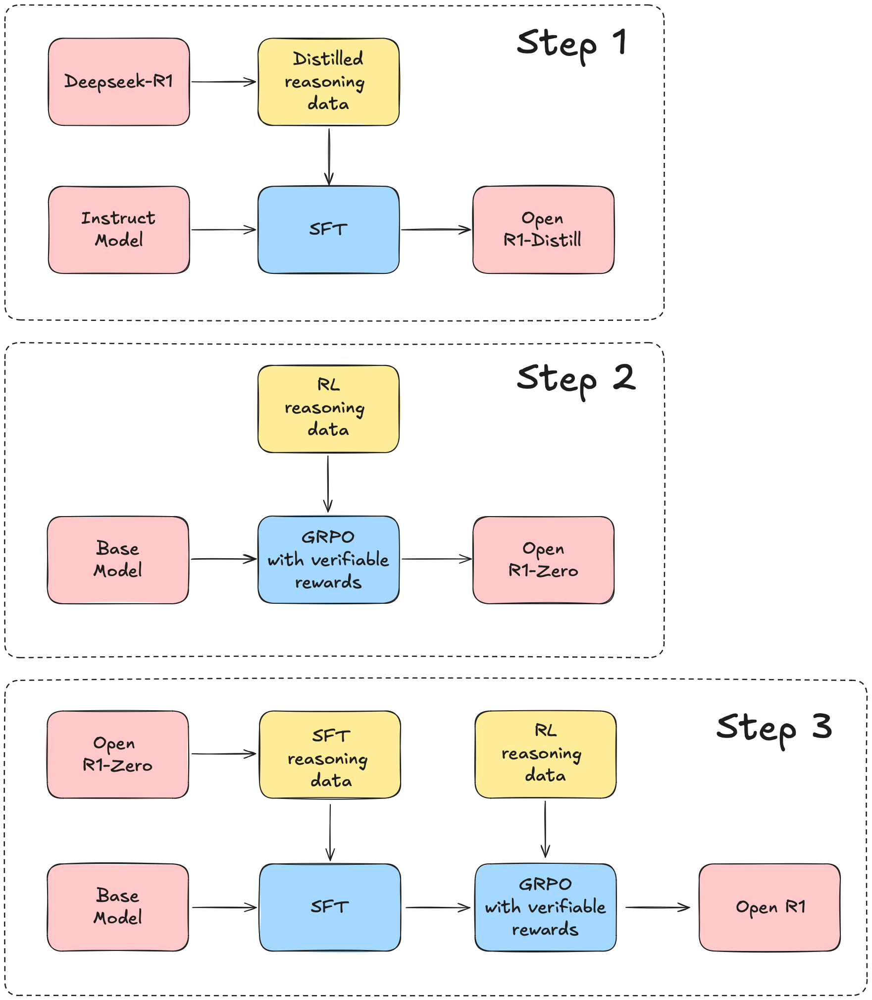

# Open R1

*DeepSeek-R1的完全开源复现版本。本项目仍在开发中，让我们一起构建它！*

**目录**  
1. [概述](#概述)  
2. [开发计划](#开发计划)  
3. [安装](#安装)  
4. [模型训练](#模型训练)  
   - [监督微调](#监督微调)  
   - [组相对策略优化](#组相对策略优化)  
5. [模型评估](#模型评估)  
6. [复现DeepSeek的评估结果](#复现deepseek的评估结果)  
7. [数据生成](#数据生成)  
   - [从小型蒸馏R1模型生成数据](#从小型蒸馏r1模型生成数据)  
   - [从DeepSeek-R1生成数据](#从deepseek-r1生成数据)  
8. [贡献](#贡献)

## 概述

本仓库的目标是构建R1流程中缺失的部分，使所有人都能够复现并在其基础上进行开发。项目设计简单，主要包含以下内容：

- `src/open_r1`: 包含用于训练和评估模型以及生成合成数据的脚本：
    - `grpo.py`: 在给定数据集上使用GRPO训练模型
    - `sft.py`: 在数据集上对模型进行简单的监督微调
    - `evaluate.py`: 在R1基准测试上评估模型
    - `generate.py`: 使用[Distilabel](https://github.com/argilla-io/distilabel)从模型生成合成数据
- `Makefile`: 包含利用上述脚本运行R1流程每个步骤的便捷命令

### 开发计划

我们将使用DeepSeek-R1的[技术报告](https://github.com/deepseek-ai/DeepSeek-R1)作为指南，大致可分为三个主要步骤：

* 步骤1：通过从DeepSeek-R1蒸馏高质量语料库来复现R1-Distill模型
* 步骤2：复现DeepSeek用于创建R1-Zero的纯强化学习流程。这可能涉及为数学、推理和代码创建新的、大规模数据集
* 步骤3：展示如何通过多阶段训练从基础模型到RL调优

<center>
    
</center>

## 新闻 🗞️

* **⚡️ [2025/03/11] [(更新 #3)](https://huggingface.co/blog/open-r1/update-3):** 我们发布了[**CodeForces-CoTs**](https://huggingface.co/datasets/open-r1/codeforces-cots)数据集，包含10k个竞赛编程问题和从R1蒸馏的100k个解决方案。我们还发布了IOI24：一个新的来自国际信息学奥林匹克的_非常_困难的基准测试。在CodeForces-CoTs上训练的7B Qwen模型可以在IOI24上超越Claude 3.7 Sonnet，而32B模型可以超越R1本身。
* **∞ [2025/02/10] [(更新 #2)](https://huggingface.co/blog/open-r1/update-2):** 我们发布了[**OpenR1-Math-220k**](https://huggingface.co/datasets/open-r1/OpenR1-Math-220k)数据集，包含从R1蒸馏的220k条新版本NuminaMath上的推理轨迹。在该数据集上训练的模型与DeepSeek的蒸馏模型性能相当。
* **🔥 [2025/02/02] [(更新 #1)](https://huggingface.co/blog/open-r1/update-1):** 我们实现了[训练](https://github.com/huggingface/open-r1?tab=readme-ov-file#training-models)、[推理](https://github.com/huggingface/open-r1?tab=readme-ov-file#data-generation)和[评估](https://github.com/huggingface/open-r1?tab=readme-ov-file#reproducing-deepseeks-evaluation-results)流程的第一部分。让我们开始吧！

## 安装

> [!CAUTION]
> 库依赖CUDA 12.4。如果您看到与段错误相关的错误，请使用`nvcc --version`仔细检查系统运行的版本。

要运行本项目中的代码，首先使用`uv`创建Python虚拟环境。
要安装`uv`，请按照[UV安装指南](https://docs.astral.sh/uv/getting-started/installation/)进行操作。

> [!NOTE]
> 作为快捷方式，运行`make install`来设置开发库（如下所示）。之后，如果一切设置正确，您可以尝试使用Open-R1模型。

```shell
uv venv openr1 --python 3.11 && source openr1/bin/activate && uv pip install --upgrade pip
```

> [!TIP]
> 对于Hugging Face集群用户，在`.bashrc`中添加`export UV_LINK_MODE=copy`以抑制来自`uv`的缓存警告

接下来，安装vLLM和FlashAttention：

```shell
uv pip install vllm==0.7.2
uv pip install setuptools && uv pip install flash-attn --no-build-isolation
```

这将同时安装PyTorch `v2.5.1`，使用这个版本**非常重要**，因为vLLM二进制文件是为它编译的。然后您可以通过`pip install -e .[LIST OF MODES]`安装特定用例所需的其余依赖。对于大多数贡献者，我们建议：

```shell
GIT_LFS_SKIP_SMUDGE=1 uv pip install -e ".[dev]"
```

接下来，登录您的Hugging Face和Weights and Biases账户：

```shell
huggingface-cli login
wandb login
```

最后，检查系统是否安装了Git LFS，以便您可以加载和推送模型/数据集到Hugging Face Hub：

```shell
git-lfs --version
```

如果未安装，请运行：

```shell
sudo apt-get install git-lfs
```

## 模型训练

我们支持使用DDP或DeepSpeed（ZeRO-2和ZeRO-3）训练模型。例如，要在从DeepSeek-R1蒸馏的数据集（如[open-r1/OpenR1-Math-220k](https://huggingface.co/datasets/open-r1/OpenR1-Math-220k)）上进行监督微调，运行：

```shell
# 通过命令行训练
accelerate launch --config_file=recipes/accelerate_configs/zero3.yaml src/open_r1/sft.py \
    --model_name_or_path Qwen/Qwen2.5-1.5B-Instruct \
    --dataset_name open-r1/OpenR1-Math-220k \
    --learning_rate 1.0e-5 \
    --num_train_epochs 1 \
    --packing \
    --max_seq_length 16384 \
    --per_device_train_batch_size 16 \
    --gradient_checkpointing \
    --bf16 \
    --output_dir data/Qwen2.5-1.5B-Open-R1-Distill

# 通过YAML配置训练
accelerate launch --config_file recipes/accelerate_configs/zero3.yaml src/open_r1/sft.py \
    --config recipes/Qwen2.5-1.5B-Instruct/sft/config_demo.yaml
```

目前支持以下任务：

* 监督微调 `sft`
* 组相对策略优化 `grpo`

> [!TIP]
> 如果您增加/减少GPU数量，我们建议也相应增加每个设备的批次大小或梯度累积步数，以保持全局批次大小不变。

默认情况下，这些脚本会将每个模型推送到您的Hugging Face Hub用户名，即`{username}/{model_name}-{task}`。您可以通过在命令中附加参数来覆盖每个YAML配置中的参数，如下所示：

```shell
# 更改批次大小、训练轮数等
accelerate launch --config_file recipes/accelerate_configs/zero3.yaml src/open_r1/sft.py \
    --config recipes/Qwen2.5-1.5B-Instruct/sft/config_demo.yaml
    --per_device_train_batch_size=1 --num_train_epochs=5
```

如果您还想覆盖Weights and Biases的默认设置，可以如下操作：

```shell
accelerate launch --config_file recipes/accelerate_configs/zero3.yaml src/open_r1/sft.py \
    --config recipes/Qwen2.5-1.5B-Instruct/sft/config_demo.yaml
    --wandb_entity huggingface --wandb_project open-r1 --run_name Qwen2.5-1.5B-GRPO
```

> [!NOTE]
> 下面的训练命令配置为8×H100s（80GB）节点。对于不同的硬件和拓扑，您可能需要调整批次大小和梯度累积步数。

### 监督微调

要在从DeepSeek-R1蒸馏的数据集（如[open-r1/OpenR1-Math-220k](https://huggingface.co/datasets/open-r1/OpenR1-Math-220k)）上进行监督微调，运行：

```shell
ACCELERATE_LOG_LEVEL=info accelerate launch --config_file recipes/accelerate_configs/zero3.yaml \
    src/open_r1/sft.py \
    --config recipes/Qwen2.5-1.5B-Instruct/sft/config_demo.yaml
```

### 组相对策略优化

要通过GRPO训练器进行训练，我们使用一个GPU运行vLLM以加快生成速度，其余GPU用于训练。例如，在具有8个GPU的节点上，设置`--num_processes`来覆盖`accelerate`配置中的默认值：

```shell
ACCELERATE_LOG_LEVEL=info accelerate launch --config_file recipes/accelerate_configs/zero2.yaml \
    --num_processes=7 src/open_r1/grpo.py \
    --config recipes/DeepSeek-R1-Distill-Qwen-1.5B/grpo/config_demo.yaml
```

> [!WARNING]
> 蒸馏的DeepSeek模型中使用的聊天模板省略了`<think>`和`</think>`标签内的推理块内容。它还预填充了带有`<think>`的助手响应，这会干扰格式奖励函数。要处理这个问题，重要的是要覆盖聊天模板，如[recipes/DeepSeek-R1-Distill-Qwen-1.5B/grpo/config_demo.yaml](./recipes/DeepSeek-R1-Distill-Qwen-1.5B/grpo/config_demo.yaml)中所示。

我们提供了一个使用GRPO进行数学推理的最小可复现实验，参考了[SimpleRL-Reason](https://hkust-nlp.notion.site/simplerl-reason)的方法，该方法使用在8K个样本上训练的7B模型。在8个H100 80G GPU上运行大约需要3小时：

```shell
ACCELERATE_LOG_LEVEL=info accelerate launch --config_file recipes/accelerate_configs/zero2.yaml \
    --num_processes=7 src/open_r1/grpo.py \
    --config recipes/Qwen2.5-Math-7B/grpo/config_simple_rl.yaml
```

我们的最终[模型](https://huggingface.co/Dongwei/Qwen-2.5-7B_Base_Math_smalllr)，虽然使用了不同的学习率、损失函数和奖励结构，但在MATH-500上达到了69.4%的准确率，比基础模型提高了17%以上。

#### 👨‍💻 使用代码解释器训练

我们提供了一个`code`奖励函数，用于在训练期间执行策略生成的代码。目前，这个奖励函数针对[Codeforces](https://codeforces.com)等代码竞赛，其中解决方案针对一组测试用例执行，整体成功率作为最终奖励返回。为了确保安全执行，我们使用[E2B](https://e2b.dev)沙箱，它们运行快速且成本低廉。要使用这个奖励函数，首先安装必要的依赖：

```shell
uv pip install -e '.[code]'
```

然后在`.env`文件中放置E2B的API令牌：

```
E2B_API_KEY="e2b_xxx"
```

然后确保您的数据集包含一个`verification_info`列，具有以下模式（采用自PrimeIntellect的优秀[数据集](https://huggingface.co/collections/PrimeIntellect/synthetic-1-67a2c399cfdd6c9f7fae0c37)的可验证问题）：

```python
{
    "language": "python",
    "test_cases": [
        {
            "input": "4\n4\n0001\n1000\n0011\n0111\n3\n010\n101\n0\n2\n00000\n00001\n4\n01\n001\n0001\n00001\n",
            "output": "1\n3 \n-1\n0\n\n2\n1 2 \n",
            "type": "stdin_stdout",
        }
    ],
}
```

例如，要在Python问题上训练一个小模型，运行：

```shell
ACCELERATE_LOG_LEVEL=info accelerate launch --config_file recipes/accelerate_configs/zero2.yaml \
    --num_processes=7 src/open_r1/grpo.py \
    --config recipes/Qwen2.5-1.5B-Instruct/grpo/config_demo_code.yaml
```

#### IOI问题

我们提供了一个`ioi_code_reward`奖励函数，用于使用[piston](https://github.com/engineer-man/piston)执行[IOI](https://hf.co/datasets/open-r1/ioi)问题。

要运行piston工作节点，请参见[slurm/piston/README.md](./slurm/piston/README.md)。
将环境变量`PISTON_ENDPOINTS`设置为`slurm`或piston工作节点端点列表。

参见[示例配方](./recipes/Qwen2.5-1.5B-Instruct/grpo/config_demo_code_ioi.yaml)了解如何使用奖励函数：
```shell
ACCELERATE_LOG_LEVEL=info accelerate launch --config_file recipes/accelerate_configs/zero2.yaml \
    --num_processes=7 src/open_r1/grpo.py \
    --config recipes/Qwen2.5-1.5B-Instruct/grpo/config_demo_code_ioi.yaml
```

#### 数据去污

根据[s1: Simple test-time scaling](https://arxiv.org/abs/2501.19393)，可以使用[scripts/decontaminate.py](./scripts/decontaminate.py)脚本对数据进行去污，该脚本使用8-gram对数据集进行去污并去重。示例运行：

```shell
python scripts/decontaminate.py \
    --dataset "open-r1/verifiable-coding-problems-python" \
    --problem_column problem \
    --cleanup
```

它将对基准测试数据集进行去污，并在之后删除受污染的样本。如果没有提供`--new_dataset_name`参数，将重用相同的数据集，添加`_decontaminated`。它针对提示运行，对于这个数据集是`problem`列，但可以提供不同的列。

脚本的参数：

```shell
usage: decontaminate.py [-h] --dataset DATASET [--split SPLIT] [--ngram_size NGRAM_SIZE] [--problem_column PROBLEM_COLUMN] [--cleanup] [--new_dataset_name NEW_DATASET_NAME]

options:
  -h, --help            show this help message and exit
  --dataset DATASET     Name of the dataset to check for contamination.
  --split SPLIT         Split to check for contamination, defaults to `train`.
  --ngram_size NGRAM_SIZE
                        Size of n-grams to build, defaults to 8.
  --problem_column PROBLEM_COLUMN
                        Name of the column containing the problem (prompt).
  --cleanup           Whether to remove the contaminated rows before pushing the dataset.
  --new_dataset_name NEW_DATASET_NAME
                        New name for the dataset. If not provided, will reuse the name and add a `_decontaminated` to the name.
```

### 在Slurm集群上启动作业

如果您有Slurm集群的访问权限，我们提供了一个`slurm/train.slurm`脚本，它将自动为您排队训练作业。您可以这样使用它：

```shell
sbatch --job-name=open_r1 --nodes=1 slurm/train.slurm {model_name} {task} {config_suffix} {accelerator}
```

这里`{model_name}`和`{task}`如上定义，而`{config_suffix}`指的是特定配置，`{accelerator}`指的是`recipes/accelerate_configs`中的🤗 Accelerate配置选择。如果您想覆盖默认配置参数，可以通过附加空格分隔的字符串（如`'--arg1=value1 --arg2=value2'`）来提供。以下是在8个GPU的1个节点上运行SFT的具体示例：

```shell
# 在Slurm上启动并覆盖默认超参数
sbatch --job-name=open_r1 --nodes=1 slurm/train.slurm Qwen2.5-1.5B-Instruct sft demo zero3 '--per_device_train_batch_size=1 --num_train_epochs=5'
```

您可以通过增加`--nodes`标志来扩展节点数量。

> [!NOTE]
> `slurm/train.slurm`中的配置针对Hugging Face计算集群进行了优化，可能需要调整以适应您自己的计算节点。

## 模型评估

我们使用`lighteval`来评估模型，在`src/open_r1/evaluate.py`中定义了自定义任务。对于适合单个GPU的模型，运行：

```shell
MODEL=deepseek-ai/DeepSeek-R1-Distill-Qwen-1.5B
MODEL_ARGS="pretrained=$MODEL,dtype=bfloat16,max_model_length=32768,gpu_memory_utilization=0.8,generation_parameters={max_new_tokens:32768,temperature:0.6,top_p:0.95}"
OUTPUT_DIR=data/evals/$MODEL

# AIME 2024
TASK=aime24
lighteval vllm $MODEL_ARGS "custom|$TASK|0|0" \
    --custom-tasks src/open_r1/evaluate.py \
    --use-chat-template \
    --output-dir $OUTPUT_DIR

# MATH-500
TASK=math_500
lighteval vllm $MODEL_ARGS "custom|$TASK|0|0" \
    --custom-tasks src/open_r1/evaluate.py \
    --use-chat-template \
    --output-dir $OUTPUT_DIR

# GPQA Diamond
TASK=gpqa:diamond
lighteval vllm $MODEL_ARGS "custom|$TASK|0|0" \
    --custom-tasks src/open_r1/evaluate.py \
    --use-chat-template \
    --output-dir $OUTPUT_DIR

# LiveCodeBench
lighteval vllm $MODEL_ARGS "extended|lcb:codegeneration|0|0" \
    --use-chat-template \
    --output-dir $OUTPUT_DIR 
```

> [!IMPORTANT]
> 您必须在`vllm`命令中设置`max_model_length=32768`以与我们为每个评估定义的`max_new_tokens`保持一致。如果没有这个，`lighteval`将抛出错误。

要增加多个GPU的吞吐量，使用_数据并行_如下：

```shell
NUM_GPUS=8
MODEL=deepseek-ai/DeepSeek-R1-Distill-Qwen-1.5B
MODEL_ARGS="pretrained=$MODEL,dtype=bfloat16,data_parallel_size=$NUM_GPUS,max_model_length=32768,gpu_memory_utilization=0.8,generation_parameters={max_new_tokens:32768,temperature:0.6,top_p:0.95}"
TASK=aime24
OUTPUT_DIR=data/evals/$MODEL

lighteval vllm $MODEL_ARGS "custom|$TASK|0|0" \
    --custom-tasks src/open_r1/evaluate.py \
    --use-chat-template \
    --output-dir $OUTPUT_DIR 
```

对于需要跨GPU分片的大型模型，使用_张量并行_并运行：

```shell
NUM_GPUS=8
MODEL=deepseek-ai/DeepSeek-R1-Distill-Qwen-32B
MODEL_ARGS="pretrained=$MODEL,dtype=bfloat16,tensor_parallel_size=$NUM_GPUS,max_model_length=32768,gpu_memory_utilization=0.8,generation_parameters={max_new_tokens:32768,temperature:0.6,top_p:0.95}"
TASK=aime24
OUTPUT_DIR=data/evals/$MODEL

export VLLM_WORKER_MULTIPROC_METHOD=spawn
lighteval vllm $MODEL_ARGS "custom|$TASK|0|0" \
    --custom-tasks src/open_r1/evaluate.py \
    --use-chat-template \
    --output-dir $OUTPUT_DIR 
```

您也可以使用`make evaluate`启动评估，指定模型、任务，以及可选的并行技术和GPU数量。

在单个GPU上评估：

```shell
make evaluate MODEL=deepseek-ai/DeepSeek-R1-Distill-Qwen-32B TASK=aime24
```

使用数据并行：

```shell
make evaluate MODEL=deepseek-ai/DeepSeek-R1-Distill-Qwen-32B TASK=aime24 PARALLEL=data NUM_GPUS=8
```

使用张量并行：

```shell
make evaluate MODEL=deepseek-ai/DeepSeek-R1-Distill-Qwen-32B TASK=aime24 PARALLEL=tensor NUM_GPUS=8
```

## 复现Deepseek的评估结果

> [!NOTE]
> DeepSeek-R1论文使用每个查询64个响应的采样来估计`pass@1`。下面，我们报告每个查询采样1个响应的结果，这可能解释了我们的结果与他们的小1-3σ差异。

### AIME 2024

我们能够在AIME 2024基准测试上复现Deepseek报告的结果，误差在约1-3个标准差内：

| 模型                         | AIME 2024 (🤗 LightEval) | AIME 2024 (DeepSeek报告) |
|:------------------------------|:-----------------------:|:----------------------------:|
| DeepSeek-R1-Distill-Qwen-1.5B |          26.7           |             28.9             |
| DeepSeek-R1-Distill-Qwen-7B   |          56.6           |             55.5             |
| DeepSeek-R1-Distill-Qwen-14B  |          60.0           |             69.7             |
| DeepSeek-R1-Distill-Qwen-32B  |          73.2           |             72.6             |
| DeepSeek-R1-Distill-Llama-8B  |          43.3           |             50.4             |
| DeepSeek-R1-Distill-Llama-70B |          73.3           |             70.0             |

要复现这些结果，使用以下命令：

```shell
NUM_GPUS=1 # 对于32B和70B模型设置为8
MODEL=deepseek-ai/{model_name}
MODEL_ARGS="pretrained=$MODEL,dtype=bfloat16,max_model_length=32768,gpu_memory_utilization=0.8,data_parallel_size=$NUM_GPUS,generation_parameters={max_new_tokens:32768,temperature:0.6,top_p:0.95}"
OUTPUT_DIR=data/evals/$MODEL

lighteval vllm $MODEL_ARGS "custom|aime24|0|0" \
    --custom-tasks src/open_r1/evaluate.py \
    --use-chat-template \
    --output-dir $OUTPUT_DIR
```

或者，您可以如下启动Slurm作业：

```shell
python scripts/run_benchmarks.py --model-id {model_id}  --benchmarks aime24
```

### MATH-500

我们能够在MATH-500基准测试上复现Deepseek报告的结果，误差在约1-3个标准差内：

| 模型                         | MATH-500 (🤗 LightEval) | MATH-500 (DeepSeek报告) |
|:------------------------------|:-----------------------:|:----------------------------:|
| DeepSeek-R1-Distill-Qwen-1.5B |          84.6           |             83.9             |
| DeepSeek-R1-Distill-Qwen-7B   |          93.0           |             92.8             |
| DeepSeek-R1-Distill-Qwen-14B  |          95.0           |             93.9             |
| DeepSeek-R1-Distill-Qwen-32B  |          96.6           |             94.3             |
| DeepSeek-R1-Distill-Llama-8B  |          88.6           |             89.1             |
| DeepSeek-R1-Distill-Llama-70B |          96.4           |             94.5             |

要复现这些结果，使用以下命令：

```shell
NUM_GPUS=1 # 对于32B和70B模型设置为8
MODEL=deepseek-ai/{model_name}
MODEL_ARGS="pretrained=$MODEL,dtype=bfloat16,max_model_length=32768,gpu_memory_utilization=0.8,data_parallel_size=$NUM_GPUS,generation_parameters={max_new_tokens:32768,temperature:0.6,top_p:0.95}"
OUTPUT_DIR=data/evals/$MODEL

lighteval vllm $MODEL_ARGS "custom|math_500|0|0" \
    --custom-tasks src/open_r1/evaluate.py \
    --use-chat-template \
    --output-dir $OUTPUT_DIR
```

或者，您可以如下启动Slurm作业：

```shell
python scripts/run_benchmarks.py --model-id {model_id}  --benchmarks math_500
```

### GPQA Diamond

我们能够在GPQA Diamond基准测试上复现Deepseek报告的结果，误差在约1-3个标准差内：

| 模型                         | GPQA Diamond (🤗 LightEval) | GPQA Diamond (DeepSeek报告) |
|:------------------------------|:---------------------------:|:--------------------------------:|
| DeepSeek-R1-Distill-Qwen-1.5B |            34.3             |               33.8               |
| DeepSeek-R1-Distill-Qwen-7B   |            50.5             |               49.1               |
| DeepSeek-R1-Distill-Qwen-14B  |            59.6             |               59.1               |
| DeepSeek-R1-Distill-Qwen-32B  |            63.6             |               62.1               |
| DeepSeek-R1-Distill-Llama-8B  |            52.0             |               49.0               |
| DeepSeek-R1-Distill-Llama-70B |            67.2             |               65.2               |

要复现这些结果，使用以下命令：

```shell
NUM_GPUS=1 # 对于32B和70B模型设置为8
MODEL=deepseek-ai/{model_name}
MODEL_ARGS="pretrained=$MODEL,dtype=bfloat16,max_model_length=32768,gpu_memory_utilization=0.8,data_parallel_size=$NUM_GPUS,generation_parameters={max_new_tokens:32768,temperature:0.6,top_p:0.95}"
OUTPUT_DIR=data/evals/$MODEL

lighteval vllm $MODEL_ARGS "custom|gpqa:diamond|0|0" \
    --custom-tasks src/open_r1/evaluate.py \
    --use-chat-template \
    --output-dir $OUTPUT_DIR
```

```shell
python scripts/run_benchmarks.py --model-id {model_id}  --benchmarks gpqa
```

### LiveCodeBench

我们能够在LiveCodeBench代码生成基准测试上复现Deepseek报告的结果，误差在约1-3个标准差内：

| 模型                         | LiveCodeBench (🤗 LightEval) | LiveCodeBench (DeepSeek报告) |
|:------------------------------|:----------------------------:|:--------------------------------:|
| DeepSeek-R1-Distill-Qwen-1.5B |             16.3             |               16.9               |
| DeepSeek-R1-Distill-Qwen-7B   |             36.6             |               37.6               |
| DeepSeek-R1-Distill-Qwen-14B  |             51.5             |               53.1               |
| DeepSeek-R1-Distill-Qwen-32B  |             56.6             |               57.2               |
| DeepSeek-R1-Distill-Llama-8B  |             37.0             |               39.6               |
| DeepSeek-R1-Distill-Llama-70B |             54.5             |               57.5               |

要复现这些结果，使用以下命令：

```shell
NUM_GPUS=1 # 对于32B和70B模型设置为8，或对于较小模型使用data_parallel_size=8以提高速度
MODEL=deepseek-ai/{model_name}
MODEL_ARGS="pretrained=$MODEL,dtype=bfloat16,max_model_length=32768,gpu_memory_utilization=0.8,data_parallel_size=$NUM_GPUS,generation_parameters={max_new_tokens:32768,temperature:0.6,top_p:0.95}"
OUTPUT_DIR=data/evals/$MODEL

lighteval vllm $MODEL_ARGS "extended|lcb:codegeneration|0|0" \
    --use-chat-template \
    --output-dir $OUTPUT_DIR
```

```shell
python scripts/run_benchmarks.py --model-id {model_id}  --benchmarks lcb
```

## 数据生成

### 从小型蒸馏R1模型生成数据

以下示例可以在1×H100上运行。
首先安装以下依赖：

```shell
uv pip install "distilabel[vllm]>=1.5.2"
```

现在将以下代码片段保存到名为`pipeline.py`的文件中，并使用`python pipeline.py`运行它。它将为10个示例中的每个生成4个输出（将仓库的用户名更改为您的组织/用户名）：

```python
from datasets import load_dataset
from distilabel.models import vLLM
from distilabel.pipeline import Pipeline
from distilabel.steps.tasks import TextGeneration


prompt_template = """\
You will be given a problem. Please reason step by step, and put your final answer within \boxed{}:
{{ instruction }}"""

dataset = load_dataset("AI-MO/NuminaMath-TIR", split="train").select(range(10))

model_id = "deepseek-ai/DeepSeek-R1-Distill-Qwen-7B"  # 替换为另一个小型蒸馏r1

with Pipeline(
    name="distill-qwen-7b-r1",
    description="A pipeline to generate data from a distilled r1 model",
) as pipeline:

    llm = vLLM(
        model=model_id,
        tokenizer=model_id,
        extra_kwargs={
            "tensor_parallel_size": 1,
            "max_model_len": 8192,
        },
        generation_kwargs={
            "temperature": 0.6,
            "max_new_tokens": 8192,
        },
    )
    prompt_column = "problem"
    text_generation = TextGeneration(
        llm=llm, 
        template=prompt_template,
        num_generations=4,
        input_mappings={"instruction": prompt_column} if prompt_column is not None else {}
    )


if __name__ == "__main__":
    distiset = pipeline.run(dataset=dataset)
    distiset.push_to_hub(repo_id="username/numina-deepseek-r1-qwen-7b")
```

查看[HuggingFaceH4/numina-deepseek-r1-qwen-7b](https://huggingface.co/datasets/HuggingFaceH4/numina-deepseek-r1-qwen-7b)上的示例数据集。


### 从DeepSeek-R1生成数据

要运行更大的DeepSeek-R1，我们使用了2个节点，每个节点有8×H100 GPU，使用本仓库中的`slurm/generate.slurm`文件。首先，安装依赖：

（目前我们需要安装vllm开发轮子，它[修复了R1 cuda图捕获](https://github.com/vllm-project/vllm/commits/221d388cc5a836fa189305785ed7e887cea8b510/csrc/moe/moe_align_sum_kernels.cu)）
```shell
pip install https://wheels.vllm.ai/221d388cc5a836fa189305785ed7e887cea8b510/vllm-1.0.0.dev-cp38-abi3-manylinux1_x86_64.whl --extra-index-url https://download.pytorch.org/whl/cu121

uv pip install "distilabel[vllm,ray,openai]>=1.5.2"
```

然后运行以下命令：

```shell
sbatch slurm/generate.slurm \
    --hf-dataset AI-MO/NuminaMath-TIR \
    --temperature 0.6 \
    --prompt-column problem \
    --model deepseek-ai/DeepSeek-R1 \
    --hf-output-dataset username/r1-dataset
```

> [!NOTE]  
> 当作业运行时，您可以通过集群登录节点设置SSH隧道来从您的计算机访问Ray仪表板，运行`ssh -L 8265:ray_ip_head_node:8265 <login_node>`，然后在浏览器中访问`http://localhost:8265`

## 贡献

欢迎贡献。请参考 https://github.com/huggingface/open-r1/issues/23。

## 致谢

本项目建立在开源AI社区许多团体和个人的集体努力之上。我们特别感谢vLLM和SGLang团队创建了高性能工具来扩展GRPO的部署。我们还感谢[OpenThoughts](https://www.open-thoughts.ai)、[Prime Intellect](https://www.primeintellect.ai)和[General Reasoning](https://gr.inc)团队创建和分享高质量的推理数据集。

## 引用

如果您在自己的工作中发现这个项目有用，请考虑如下引用：

```
@misc{openr1,
    title = {Open R1: A fully open reproduction of DeepSeek-R1},
    url = {https://github.com/huggingface/open-r1},
    author = {Hugging Face},
    month = {January},
    year = {2025}
}
``` 